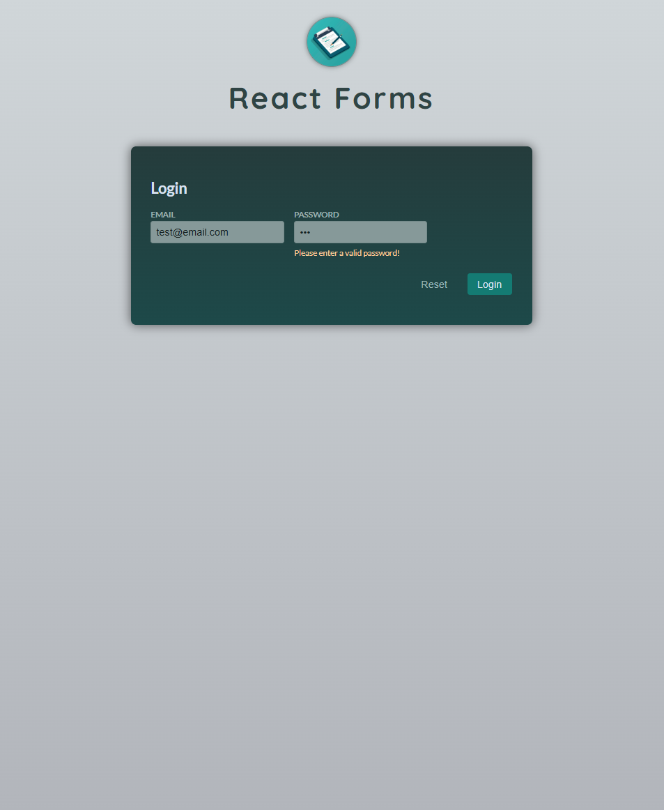

# Login Form with Custom Hook and Validation

A React app that provides a simple login form with custom hooks for managing form input and validation. The form includes fields for Email and Password and validates the inputs using a set of helper functions. The app leverages custom hooks for handling input changes and form submissions, making it easy to manage the form state and validation logic.
This project demonstrates the use of custom hooks, validation functions, and conditional rendering in React for efficient form handling.
<br><br>


## 🚀 Getting Started

### **Prerequisites**
Make sure you have the following installed before running the project:
- **Node.js** (Download from [nodejs.org](https://nodejs.org/))
- **npm** or **yarn** (Comes with Node.js)
<br>

### **Installation**
1. Clone this repository:
   ```sh
   git clone https://github.com/nathenpriyonggo/react-forms
   ```
2. Navigate to the directory
   ```sh
   cd react-forms
   ```
3. Install dependencies:
   ```sh
   npm install
   ```
4. Start the development server:
   ```sh
   npm run dev
   ```
5. Open ```http://localhost:5173/``` in your browser.
<br>

## 🛠️ Built With
- **React** - A JavaScript library for building user interfaces
- **Vite** - A fast build tool for modern web projects
- **Conditional Rendering** - To handle form validation error messages dynamically
- **Validation Functions** - Simple validation functions for checking email, password, and empty fields
<br>

## 🎮 App Features
- **Email and Password Inputs** - Form fields for email and password with live validation.
- **Custom Hook for Input Management** - The app uses a custom useInput hook to manage the state, change handlers, and validation for the form inputs.
- **Form Validation** - Email is validated using the isEmail and isNotEmpty functions, while the password is validated using hasMinLength to ensure a minimum length of 6 characters.
- **Error Handling** - Displays error messages dynamically if the user enters invalid email or password data.
- **Reset Button** - Resets the form values to their initial states.
- **Submit Button** - Only submits the form if both the email and password are valid.
<br>


## 🖥️ Preview
<p align="center"></p>
<br>

## 📜 License
This project is open-source. Feel free to fork, modify, and expand upon it!
<br><br>


---

✨ Happy coding! 🚀
